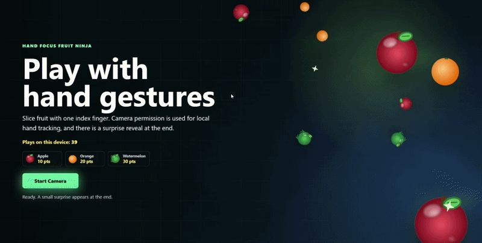
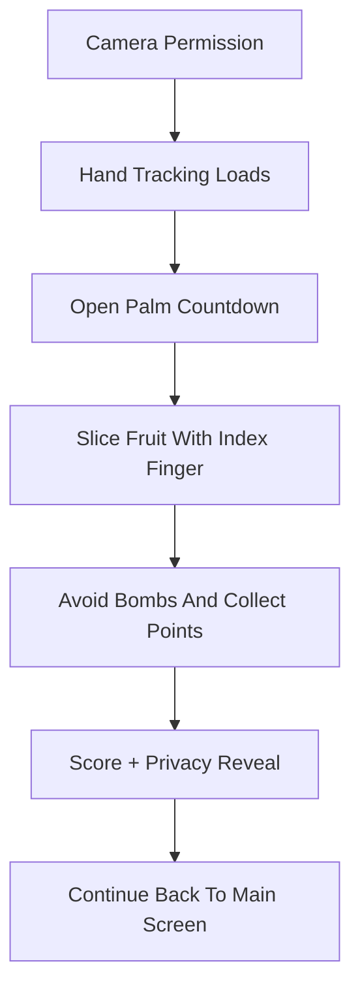

<div align="center">


# Hand Focus Fruit Ninja Web


[Play Live Demo](https://handdetectiongamecamera.vercel.app/)

</div>

## Gameplay Preview

<div align="center">



</div>

## Project Flow



## Stack

| Layer | Technology |
| --- | --- |
| App bundler | Vite |
| Language | JavaScript |
| Rendering | HTML Canvas |
| Hand tracking | MediaPipe Tasks Vision |
| Camera access | Browser MediaDevices API |
| Styling | CSS |
| Assets | PNG, SVG, WAV, MP3 |

## Run

```powershell
npm.cmd install
npm.cmd run dev
```

## Build

```powershell
npm.cmd run build
```

## License

Personal use is free with credit. Commercial use requires a paid license.

See [LICENSE.md](LICENSE.md) for details.

